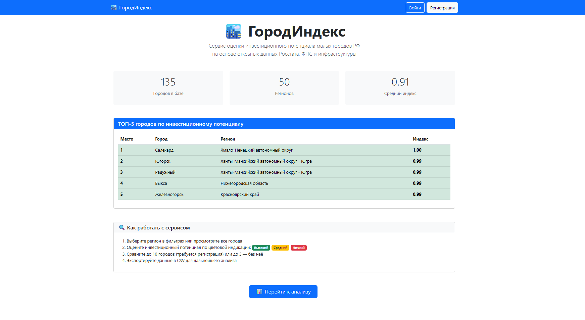
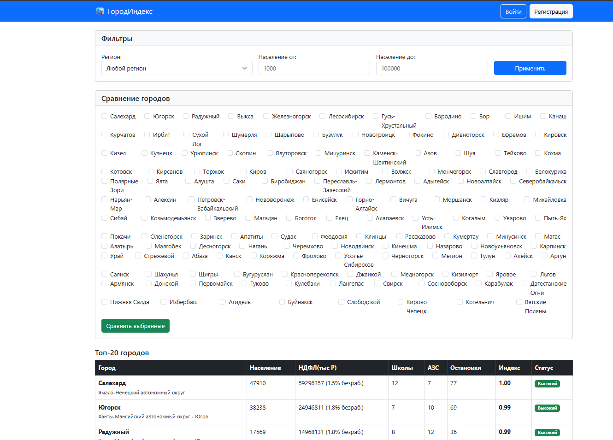

# ГородИндекс
### Сервис оценки инвестиционного потенциала малых городов РФ (до 100 тыс. жителей) наоснове открытых данных Росстата, ФНС и инфраструктуры OpenStreetMap.

## 🎯 Цель проекта
Помочь инвесторам, предпринимателям и аналитикам быстро оценить привлекательность 
малых городов для запуска бизнеса или социальных проектов без ручного анализа 
десятков таблиц.

## 👥 Целевая аудитория
Гость: демо-сравнение до 3 городов
Полная фильтрация по регионам и населению
Экспорт данных в CSV

Аналитик (авторизованный пользователь):
Сравнение до 10 городов с детальной визуализацией

🛠️ Технологический стек
Backend: Django 5.2.9

Анализ данных: Pandas, Plotly

Источники данных:
Открытые Excel-файлы Росстата (численность населения)
Данные УФНС по регионам (НДФЛ)
OpenStreetMap (инфраструктурные объекты)

Frontend: Bootstrap 5, Plotly.js

Хостинг: PythonAnywhere

## 📊 Методология расчёта
Инвестиционный индекс города рассчитывается по формуле:
```
Индекс = 0.4 × (НДФЛ на душу / медиана по региону) 
         + 0.3 × (1 − уровень безработицы / 100) 
         + 0.3 × (инфраструктурный балл)
```

# Внешний вид





# Инструкция по запуску

**Клонирование репозитория**

```
git clone https://github.com/7cco/cityindex
cd cityindex
```

**Создание виртуального окружения**

`python -m venv venv`

`source venv/bin/activate`  #Linux

`venv\Scripts\Activate.ps1`  #Windows

**Установка зависимостей**
`pip install -r requirements.txt`

**Применение миграций**
`python manage.py migrate`

**Загрузка данных**
`python manage.py fetch_data`

**Создание суперпользователя**
`python manage.py createsuperuser`

**Запуск сервера**
`python manage.py runserver`